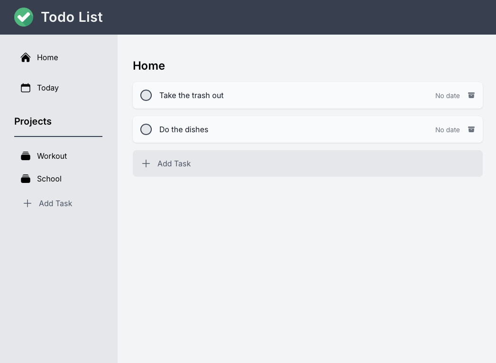

# Todo List App

## Overview
A basic todo list application created with HTML, CSS, and JavaScript. This project was developed as part of a JavaScript learning journey.

## Features
- Add new tasks
- Mark tasks as completed
- Delete tasks
- Simple and clean interface

## Live Preview
You can try the live version of the Matrix Solver at the following link: [Todo List App Live Preview](https://kingliban.github.io/Todo-List/)



## Getting Started

### Prerequisites
- A modern web browser

### Running the Application
1. Clone the repository:
   ```bash
   git clone https://github.com/KingLiban/todo-list.git
   cd todo-list-app
   ```

2. Open `template.html` in your web browser.

### Development (Optional)
If you want to make changes and use webpack:

1. Install dependencies:
   ```bash
   npm install
   ```

2. Run webpack to build the project:
   ```bash
   npx webpack
   ```

## License
This project is licensed under the MIT License.
